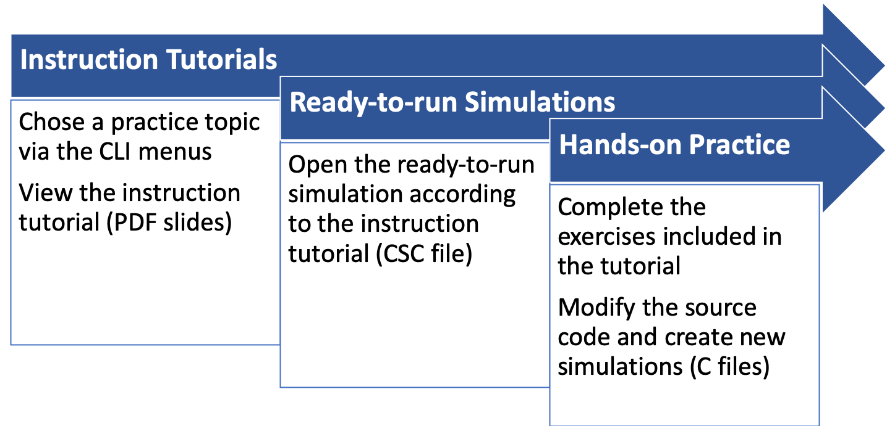
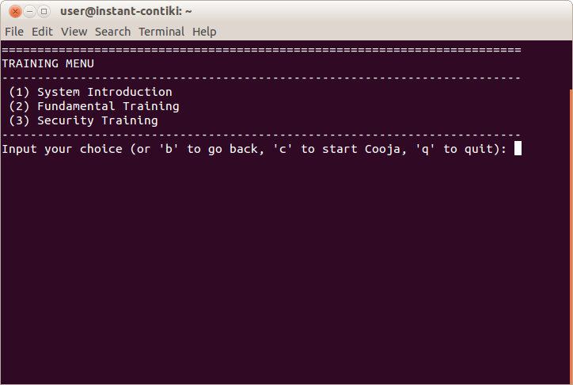

# IoTrain-Sim: IoT Training System Using the Cooja Network Simulator

IoTrain-Sim is a system that uses the Cooja network simulator and
Contiki OS for IoT education and training purposes. IoTrain-Sim
provides users with training tutorials and generated IoT device and
attack simulations so that they can master the basics of IoT and IoT
security. The included tutorials allow users to do hands-on practice
with simulated IoT devices so that they can get started quickly when
developing real IoT applications.

An overview of the architecture of IoTrain-Sim is provided in the
figure below.

<div align=center></div>


## Training Process

Training activities that make use of IoTrain-Sim are typically
conducted according to the work flow indicated below.

<div align=center></div>

<br>

The training content currently provided with IoTrain-Sim is structured
as shown in the next figure.

<div align=center></div>


## Setup

Follow the steps below in order to setup IoTrain-Sim:

1. **Download Instant Contiki**: Instant Contiki is a virtual machine
   (VM) image provided by Contiki developers that contains all the
   necessary tools to run Cooja. The easiest way to get started with
   our system is to install it into the Instant Contiki VM. You can
   use the link below to download the Instant Contiki 3.0 VM image;
   note that older VM versions are not compatible with the current
   IoTrain-Sim content. After downloading the archive (which is has
   over 3 GB), unzip it and proceed to the next step.

   >[Instant Contiki 3.0 Repository](https://sourceforge.net/projects/contiki/files/Instant%20Contiki/Instant%20Contiki%203.0/)

2. **Install VMware Virtualization Software**: The Instant Contiki
   file that you downloaded is a VMware virtual machine image,
   therefore you need to use VMware virtualization software to run
   it. VMware Workstation Player (formerly VMware Player) is such a
   solution for Windows and Linux, and VMware Fusion is the equivalent
   for macOS. See the links below for download and license
   information.

   >[VMware Workstation Player for Windows/Linux](https://www.vmware.com/products/workstation-player.html)<br>
   >[VMware Fusion for macOS X](https://www.vmware.com/products/fusion.html)

3. **Start Instant Contiki**: In order to start Instant Contiki, you
   need to open the main VM image file (the one with extension `.vmx`)
   from the extracted Instant Contiki archive in the VMware software
   and power it on. Wait for the machine to boot up, then log in; the
   default password is "user", but it is advisable to change it after
   the first login. According to Contiki developers, it is necessary
   to prepare the submodules in the OS source code before being able
   to run Cooja; to do that, open a terminal in the Instant Contiki VM
   and run the command below:

   ```
   cd contiki && git submodule update --init && cd ..
   ```

4. **Install IoTrain-Sim**: To install IoTrain-Sim, we recommend that
   you download the latest version of the software from the
   [releases](https://github.com/crond-jaist/iotrain-sim/releases)
   page on GitHub in the Instant Contiki VM. The IoTrain-Sim code
   assumes that the archive will be extracted in the directory
   `/home/user/iotrain-sim/`; in case you use a different location,
   you need to update accordingly the variable `IOTRAIN_PATH` in the
   file `code/storyboard.py`.


## Quick Start

In order to run IoTrain-Sim, use a terminal window in the Instant
Contiki VM to execute the following command:

```
$ ./iotrain-sim/code/iotrain-sim.py
```

Once the training interface is displayed as shown in the screenshot
below, we suggest that you select the menu entry `(1) System
Introduction` for an overview of IoTrain-Sim. To learn more about the
available training content in IoTrain-Sim, and especially about how to
add new training content to the IoTrain-Sim database, see the
[Training Content Guide](content_guide.md) that we also make available
in the distribution.

<div align=center></div>


## References

[//]: # (For a research background regarding IoTrain-Sim, refer to the
following paper:)

For a list of contributors to this project, check the file
CONTRIBUTORS included with the source code.
