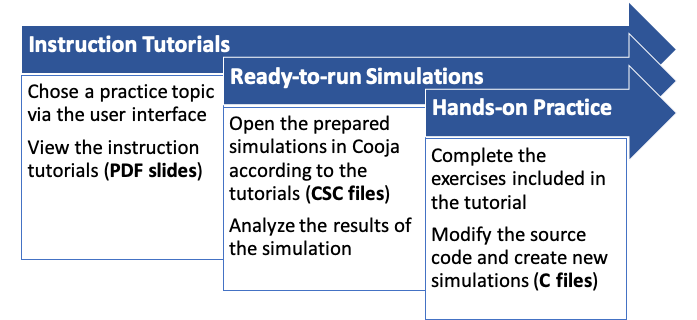
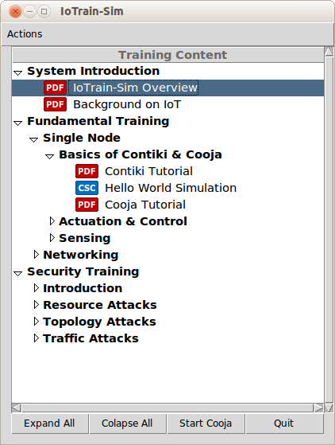

# IoTrain-Sim: IoT Training System Using the Cooja Simulator

IoTrain-Sim is an integrated training system that makes use of the
Cooja network simulator and Contiki OS for IoT education and training
purposes. The system provides training tutorials and ready-to-use
simulations making it possible for learners to easily master the
basics of IoT and IoT security. The included hands-on practice with
simulated IoT devices helps learners get ready to implement real IoT
applications in the future.

An overview of the architecture of IoTrain-Sim is provided in the
figure below.

<div align=center></div>


## Training Process

Training activities that make use of IoTrain-Sim are typically
conducted as illustrated next.

<div align=center></div>

<br>

The training content currently provided with IoTrain-Sim is structured
as shown below.

<div align=center></div>


## Setup

The following steps are necessary in order to set up IoTrain-Sim:

1. **Download Instant Contiki**: Instant Contiki is a virtual machine
   (VM) image provided by Contiki developers that contains all the
   necessary tools to run Cooja. The easiest way to get started with
   our system is to install it into the Instant Contiki VM. Use the
   link below to download the Instant Contiki 3.0 VM image (note that
   older VM versions are not compatible with the current IoTrain-Sim
   content). After downloading the archive, which is has over 3 GB,
   unzip it and proceed to the next step.

   >[Instant Contiki 3.0 Repository](https://sourceforge.net/projects/contiki/files/Instant%20Contiki/Instant%20Contiki%203.0/)

2. **Install VMware Virtualization Software**: The downloaded Instant
   Contiki file is a VMware virtual machine image, hence the VMware
   virtualization software is needed to run it. VMware Workstation
   Player (formerly VMware Player) is such a solution for Windows and
   Linux, and VMware Fusion is the equivalent for macOS. See the links
   below for download and license information.

   >[VMware Workstation Player for Windows/Linux](https://www.vmware.com/products/workstation-player.html)<br>
   >[VMware Fusion for macOS](https://www.vmware.com/products/fusion.html)

3. **Start Instant Contiki**: In order to start Instant Contiki, use
   the VMware program to open the main VM image file (the one with
   extension `.vmx`) from the extracted Instant Contiki archive and
   power it on. Wait for the machine to boot up, then log in; the
   default password is "user", but for security reasons you should
   change it after the first login. According to the Contiki
   developers, it is necessary to prepare the submodules in the OS
   source code before being able to run Cooja. To do that, open a
   terminal in the Instant Contiki VM and run the command below:

   ```
   cd contiki && git submodule update --init && cd ..
   ```

4. **Install IoTrain-Sim**: To install IoTrain-Sim, from the Instant
   Contiki VM download the latest version of the software from the
   [releases](https://github.com/crond-jaist/iotrain-sim/releases)
   page on GitHub. The IoTrain-Sim code assumes that the archive will
   be extracted into the directory `/home/user/iotrain-sim/`. In case
   you use a different location, update accordingly the variable
   `IOTRAIN_PATH` in the file `code/storyboard.py`. Next, install the
   Python Tkinter toolkit used for the IoTrain-Sim GUI by running the
   command below:

   ```
   sudo apt-get install python-tk
   ```


## Quick Start

In order to run IoTrain-Sim, use a terminal window in the Instant
Contiki VM to execute the following command:

```
$ ./iotrain-sim/code/iotrain-sim.py
```

Once the training interface is displayed as shown in the screenshot
below, we suggest that you select the menu entry `System Introduction`
&gt; `IoTrain-Sim Overview` for an introduction to IoTrain-Sim. To
learn more about the available training content, and especially about
how to add new training content to the IoTrain-Sim database, see the
[Training Content Guide](content_guide.md) that is also available in
the distribution.

<div align=center></div>

**_NOTE:_** In addition to the graphical user interface (GUI) above,
  the legacy command-line interface (CLI) can also be used by
  providing the option `--cli` when starting IoTrain-Sim.


## References

For a research background regarding IoTrain-Sim, please refer to the
following document:

* J. Wang, "IoT Training System Using the Cooja Network Simulator",
  Master's thesis, March 2019. https://hdl.handle.net/10119/15885

For a list of contributors to this project, please check the file
CONTRIBUTORS included with the source code.
