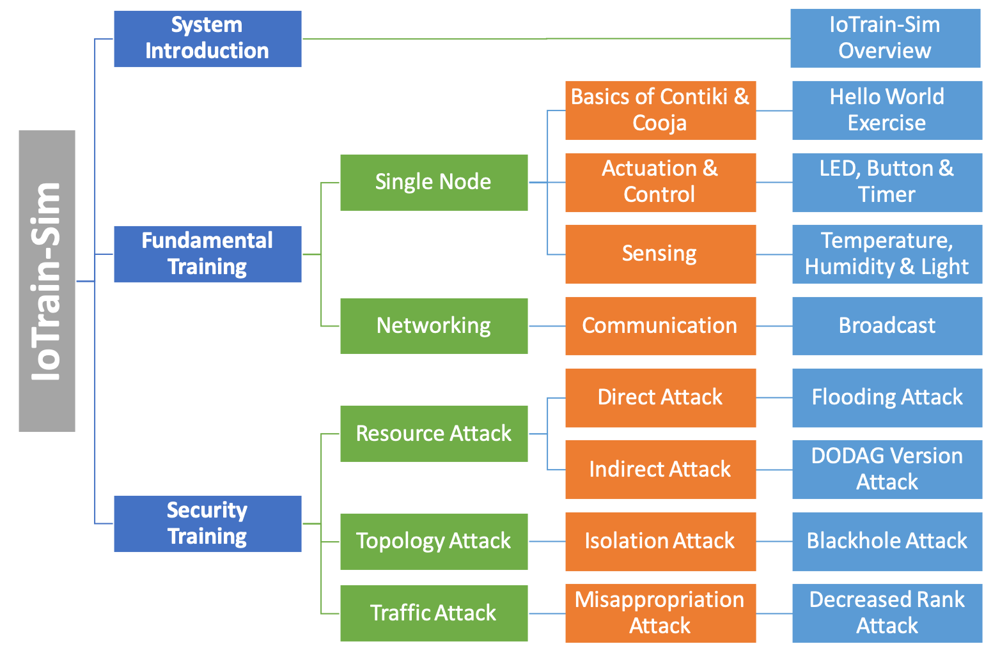

# Training Content Guide

This file includes information about the existing training content
included with IoTrain-Sim, as well as details about the procedure of
adding new training content to the system.

## Content Structure

For someone who wants to learn about IoT, the first thing to do is to
acquire basic knowledge regarding IoT devices, and then to understand
more advanced concepts, such as networking or security. Thus, when
designing the training content structure, we divided it into three
categories, namely System Introduction, Fundamental Training, and
Security Training, as shown in the following figure.

### System Introduction

The system introduction is aimed at all users who are using
IoTrain-Sim for the first time. It covers the background of IoT
technologies and IoT security, and also includes information about how
to use our system.

### Fundamental Training

The fundamental training category is further divided into two classes:
training with a single node and training with networks. In the first
class, the basics of Contiki OS and Cooja network simulator are
presented first. Then, several Contiki-based IoT devices are
introduced, such as actuators, controllers, and sensors. The second
class focuses on network communication techniques with application to
IoT devices, with examples of broadcast, unicast and multicast
communication.

### Security Training

The security training category includes examples of several attack
simulations relevant to IoT technologies as used in wireless sensor
networks (WSN). Depending on the attack mechanism, we distinguish
three types of attacks: on resources, on topology, and on network
traffic. Various examples are included for each type of attack, such
as flooding attack, blackhole attack, and so on.

## Content Creation

Two steps are required in order to add new content to IoTrain-Sim:

1. Add specific files to the training database that is located in the
directory called ``database/``

2. Register the new files with IoTrain-Sim (see the bottom of this
page for instructions)

### 1) File Creation

There are three types of content files in IoTrain-Sim. The first type
is **PDF** (Portable Document Format), which is used for training
tutorials. The second type is **CSC** (Cooja Simulation
Configuration), which is a file type that can be imported into the
Cooja network simulator. The third type is **C** language application
source code; files of this type can be implemented by advanced users
under the guidance of the tutorials, or they can represent Contiki
source code modified to implement attacks.

#### Tutorial Files

To create tutorials, developers first need to study a variety of
materials, then create slides in PDF format (for instance, by
exporting them from Microsoft PowerPoint), and finally store these PDF
files in the training database. The creation procedure is illustrated
below.

#### Simulation Files

The way in which simulations are implemented depends on scenario
complexity. Below we provide suggestions for the two categories of
training content that we currently have, fundamental training and
security training.

##### Fundamental Training Simulations

To implement a fundamental training simulation, one has to first write
a Contiki OS application using C language according to the programming
rules of Contiki, and save it as a C file. Then, one must import the
application into the Cooja network simulator, and select an
appropriate hardware platform for compiling and generating the
simulation. Finally, the simulation should be saved in the training
database as a CSC file, so that trainees can simply open the
simulation through the Cooja interface. Note that each source file in
a simulation can only generate one type of mote, but the number of
motes of a given type is not limited. The implementation procedure is
shown below.

##### Security Training Simulations

Our approach to security training is two have two simulations per
training topic, a *reference simulation* that contains the normal
conditions for a scenario, and an *attack simulation* that includes
malicious nodes. Trainees are advised to run both these simulations,
then use Cooja tools, such as the ``collect-view`` application
pictured below, to visualize simulation conditions and investigate
issues related to the attack scenario, such as identifying the
malicious nodes, determining the effects of the attack, and so on.

 

Consequently, developers must first implement the reference
simulation. The C files for security training simulations are based on
sample files already included in Contiki OS. For example, for a
scenario with a sink mote and multiple sources, the sink mote is based
on ``contiki/examples/ipv6/rpl-collect/sink.c``, and the source mote
is based on
``contiki/examples/ipv6/rpl-collect/udp-sender.c``. Essentially, the
steps to create a reference simulation are the same as the steps for
creating a fundamental training simulation. Considering the example
above, one must import and compile the ``sink.c`` file in Cooja to
generate a sink mote, then import and compile the ``udp-sender.c``
file to generate multiple source motes.

For creating an attack simulation, we recommend to start with a
reference simulation scenario, and replace a source mote in the
reference simulation with a malicious node, which will perform some
kind of attack. The steps to achieve this are detailed below:

1. Duplicate the Contiki OS folder ``contiki/`` to create a new OS
instance.

2. Modify files as necessary according to the desired attack; for
example, to implement a flooding attack, the files ``rpl_private.h``
and ``rpl_timers.c`` need to be modified.

3. Create a new malicious mote in Cooja, for instance by compiling the
``udp-sender.c`` file within the duplicated Contiki OS directory.

4. Add the malicious mote to the reference simulation scenario to
transform it into an attack scenario.

Both for reference and attack simulations, the resulting CSC files
should be saved into the training database. Intermediate users can
view these simulations so as to gain insight into an attack, while
advanced trainees could even be tasked with modifying Contiki source
code in order to implement attacks by themselves under the guidance of
tutorials.

### 2) File Registration

Once the new training content files are created and added into the
training database directory, they need to be registered with
IoTrain-Sim, so that they are displayed in its command-line
interface. For this purpose, the file ``code/content.py`` needs to be
updated. Please use the currently provided file as a template, and add
entries to it as needed by using the Python initialization syntax for
the 'OrderedDict' type of dictionary objects (more details are
available in the file).

### Additional Training Files

IoTrain-Sim provides support for including additional training files,
such as precompiled binaries, that can be used in simulations without
the need to perform any additional setup steps, such as compilation,
etc. These files are located in the directory 'database/contiki/' of
the IoTrain-Sim distribution, and are automatically copied in the
Contiki source code directory when IoTrain-Sim starts, preserving the
directory structure and even creating new subdirectories if
necessary. Note that when IoTrain-Sim execution ends, these files are
removed automatically from the Contiki source code directory, leaving
it in a "clean" state. Several such firmware binaries are already
included in the IoTrain-Sim distribution, and are used to run attack
simulations with malicious nodes without the need to compile the
firmware at runtime.
