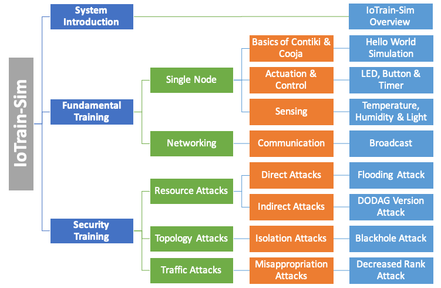
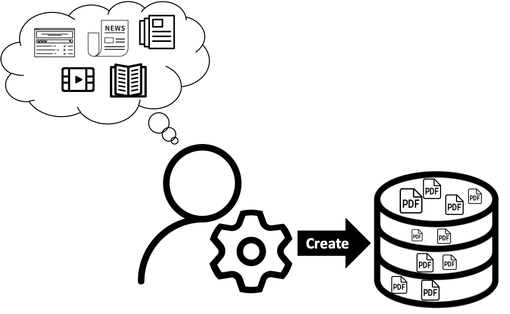
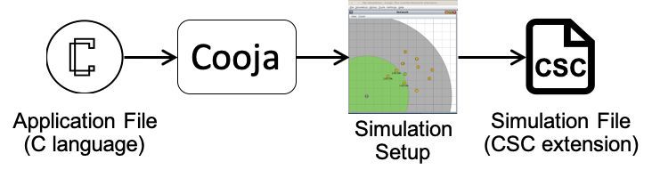
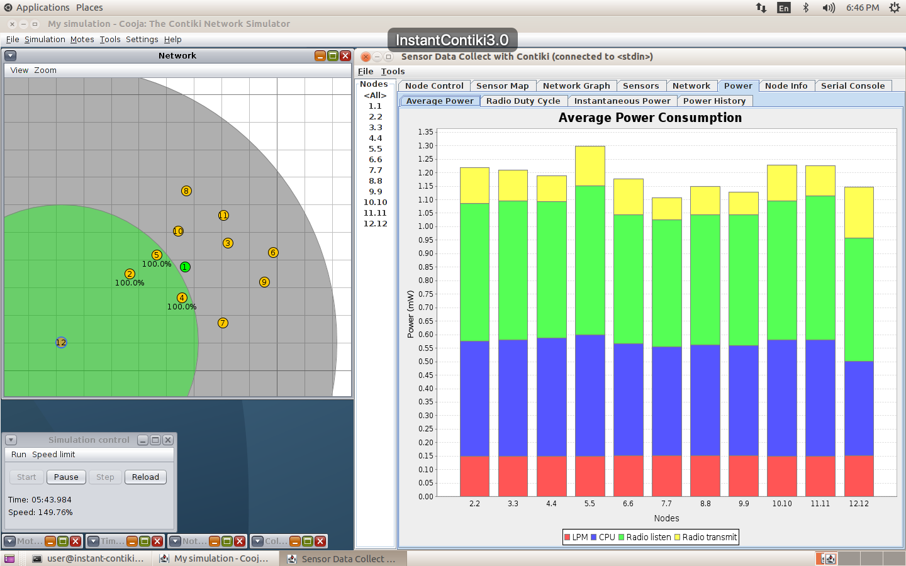

# Training Content Guide

This file includes information about the training content included
with IoTrain-Sim, as well as details about the procedure of adding new
training content to the system.

## Content Structure

For someone who wants to learn about IoT, the first thing to do is to
acquire basic knowledge regarding IoT devices, then to understand more
advanced concepts, such as networking or security. Thus, when
designing the training content structure, we divided it into three
categories, namely `System Introduction`, `Fundamental Training`, and
`Security Training`, as shown in the following figure.

### System Introduction

The system introduction is aimed at all users who are using
IoTrain-Sim for the first time. It begins with an overview of the
system itself, then covers the background of IoT technologies and IoT
security.

### Fundamental Training

The fundamental training category is further divided into two areas:
`Single Node` and `Networking`. The first content area starts by
presenting the basics of Contiki OS and Cooja, including a `Hello
World Simulation` tutorial. Several Contiki-based IoT devices are
introduced next, such as actuators, controllers, and sensors. The
second content area focuses on network communication techniques
employed by IoT devices, with examples of broadcast communication,
which is often used by sensor devices.

### Security Training

The security training category includes examples of several attack
simulations relevant to IoT technologies as used in Wireless Sensor
Networks (WSN). Depending on the attack mechanism, we distinguish
three types of attacks: `Resource Attacks`, `Topology Attacks`, and
`Traffic Attacks`. Following a tutorial on security training and an
introduction to routing protocols, we present various hands-on
exercises, such as `Flooding Attack`, `Blackhole Attack`, and so on.

## Content Creation

Two steps are required in order to add new content to IoTrain-Sim, as
explained below:

1. Add specific files to the training database that is located in the
   directory `database/`

2. Register the new files with IoTrain-Sim (see the bottom of this
   page for instructions)

### 1. File Creation

There are three types of content files in IoTrain-Sim. The first type
is **PDF** (Portable Document Format), which is used for training
tutorials. The second type is **CSC** (Cooja Simulation
Configuration), which is a file type that can be opened into the Cooja
network simulator. The third type is **C** language source code, for
original and modified Contiki files that we provide as attack
implementations, which can also be created by advanced users under the
guidance of tutorials.

#### Training Tutorials

To create tutorials, developers first need to study a variety of
materials, then create slides in PDF format (for instance, by
exporting them from Microsoft PowerPoint), and finally store these PDF
files in the training database. This tutorial creation procedure is
illustrated below.

#### Simulation Files

Below we provide simulation implementation suggestions for the two
categories of training content included in IoTrain-Sim, fundamental
training and security training.

a. Fundamental Training Simulations

To implement a fundamental training simulation, first write a Contiki
OS application using C language according to the programming rules of
Contiki, and save it as a C file. Then, import the application into
the Cooja network simulator, and select an appropriate hardware
platform for compiling and generating the simulation. Finally, save
the simulation in the training database as a CSC file, so that
trainees can simply open it via Cooja to do the training. The
implementation procedure is illustrated below.

b. Security Training Simulations

Our approach to security training is two have two simulations per
training topic: a *reference simulation* that contains the normal
conditions for a scenario, and an *attack simulation* that includes
malicious nodes for that scenario. Trainees are advised to run both
these simulations, then use Cooja tools, such as the `collect-view`
application pictured below, to visualize simulation conditions and
investigate issues related to the attack scenario, such as identifying
the malicious nodes, determining the effects of the attack, and so on.

 

Developers should first implement the reference simulation based on
the sample C files included in Contiki OS. For example, for a scenario
with a sink mote and multiple sources, the sink mote can be based on
`sink.c`, and the source mote can be based on `udp-sender.c`, both
located in `contiki/examples/ipv6/rpl-collect/`. Essentially, the
steps to create a reference simulation are the same as the steps for
creating a fundamental training simulation explained above, and the
appropriate files must be compiled in Cooja and used to create
simulated motes.

For creating an attack simulation, we recommend to start with a
reference simulation scenario, then replace a source mote in the
reference simulation with a malicious mote that will perform some kind
of attack. The steps to achieve this are detailed below:

1. Duplicate the Contiki OS folder `contiki/` to create a new OS
   instance.

2. Modify files as necessary according to the desired attack. For
   example, to implement a flooding attack the files `rpl_private.h`
   and `rpl_timers.c` should be modified.

3. Create a new malicious mote in Cooja, for instance by compiling the
   `udp-sender.c` file within the duplicated Contiki OS directory.

4. Use the malicious mote to replace one of the motes in the reference
   simulation scenario in order to transform it into an attack
   scenario.

Both for reference and attack simulations, the resulting CSC files
should be saved into the training database. Intermediate users can
view these simulations in order to gain insight into an attack, while
advanced trainees could be tasked with modifying Contiki source code
in order to implement by themselves attacks and even defense
mechanisms under the guidance of tutorials.

#### Additional Training Files

IoTrain-Sim provides support for including additional training files,
such as precompiled binaries, that can be used in simulations without
the need to perform any compilation. For this purpose, all the files
located in the directory `database/contiki/` of IoTrain-Sim are
automatically copied in the Contiki source code directory when the
program starts, preserving the directory structure and even creating
new subdirectories if necessary. When IoTrain-Sim execution ends,
these files are removed automatically from the Contiki source code
directory, leaving it in a "clean" state. Several such firmware
binaries are already included in the IoTrain-Sim distribution, and are
used to run example attack simulations with malicious motes without
the need to compile the firmware.

### 2. File Registration

Once the new training content files are created and added into the
training database directory, they need to be registered with
IoTrain-Sim, so that they are displayed in its user interface. To do
this, update the file `code/content.py` by adding entries to it as
needed using the Python initialization syntax for the 'OrderedDict'
type of dictionary objects, as illustrated in the file.
